# LabH1 report

> **PB21000039 陈骆鑫**


## 实验目的与内容

1. 完成适用于RISC-V的ALU模块的设计与仿真。
2. 完成MAV（求大小为4的滑动平均）模块的设计、仿真和上板测试。
3. 完成32位ALU的上板测试。


## 逻辑设计

### 1.ALU逻辑设计

- 在功能选择为0（减法）时，需要在t处输出是否相等、有符号数小于和无符号数小于这三个信号。

  - 对于是否相等，我们可以直接使用verilog提供的==运算符。
  - 由于没有声明signed时，verilog默认将数作为无符号数运算，我们也可以直接使用<运算符实现。
  - 对于有符号数小于：
    - 两个数符号位不同时，可以根据符号位直接得出大小关系。
    - 两个数符号位相同时，看作有符号数和看作无符号数时大小关系相同。

- 之后是8种运算的实现。

  - 注意到对于加、减和逻辑运算与、或、异或，看作有符号数和无符号数没有不同，可以直接使用verilog的对应运算符。
  - 对于逻辑左移、右移，看作有符号数和无符号数也没有不同，同样可以使用对应运算符。
  - 对于算术右移，如果使用>>>运算符，verilog默认将操作数看作无符号数，导致行为与逻辑右移相同，这显然是不正确的。一个简单的修改是以$signed()函数将a转换为有符号数，再进行运算。
  - 注意：对于左移、右移运算，操作数b的大小不应大于或等于a的位数；为确保这一点，在RV64I中，移位运算只使用寄存器的低6位。但由于这次实验中ALU要求可以指定数据宽度，这点并不能较好实现：数据宽度甚至不一定是2的次方，如果简单的使用b的低位，仍然无法保证运算合法。这里索性没有考虑b是否符合范围，直接将b作为运算符的第二个操作数；当CPU等项目需要使用专用ALU时，再视情况在外部或ALU内部做处理。

- ALU代码如下：

  - ``` verilog
    module alu #(
        parameter WIDTH = 32
    )(
        input [WIDTH-1:0] a, b,
        input [2:0] f,
        output reg [WIDTH-1:0] y,
        output [2:0] t
    );
        assign t[0] = (f == 0) ? (a == b) : 0;
        assign t[1] = (f == 0) ?((a[WIDTH-1] == b[WIDTH-1]) ? (a < b) : (a[WIDTH-1] > b[WIDTH-1])) : 0;
        assign t[2] = (f == 0) ? (a < b) : 0;
    
        always @(*) begin
            y = 0;
            case (f)
                3'd0: y = a - b;
                3'd1: y = a + b;
                3'd2: y = a & b;
                3'd3: y = a | b;
                3'd4: y = a ^ b;
                3'd5: y = a >> b;
                3'd6: y = a << b;
                3'd7: y = $signed(a) >>> b;
            endcase
        end
    endmodule
    ```

### 2.MAV模块设计

- 要求4个数的滑动平均，只要维护最近3个数`mi1`，`mi2`，`mi3`和它们的和`sum3`，就可以在数`d`新到来的第一个时钟周期内计算出滑动平均，第二个时钟周期完成维护变量的计算。

  - 为了在第一个时钟周期内计算出滑动平均，ALU在闲置状态下应始终置于`sum3+d`的状态。这样在`en`的上升沿到来时（本段`en`均指取边沿后的），可以立即用ALU输出算数右移两位更新答案。在同一个时钟周期，将`sum3`赋值为ALU输出（重复利用同一个结果以减少浪费）。
  - 第二个时钟周期内完成维护：将`sum3`赋值为`sum3-mi3`，这样`sum3`的维护就已经完成了。对最近三个数的维护类似于移位寄存器：令`mi1=d`，`mi2=mi1`，`mi3=mi2`即可。

- 但注意到要求在输入的数小于4个，即已经保存的数小于3个时，应该直接输出`d`。这样，我们需要额外记录当前已经保存的数。

  - 简单的思路是直接保存一个计数器`cnt`，每次完成维护后让`cnt`自增。
  - 但`cnt`自增需要利用ALU，会导致每次处理的时间增加一个时钟周期。一个更好的思路是另外构造一个4种状态的Moore型自动机，每次`en`上升沿从状态`0/1/2`转换为`1/2/3`，而从状态3只能转换到自身，并将是否为状态3作为输出。这样既能保持并行，又节省了资源。

- 注：如果使用外部的取边沿模块给`en`取边沿，则`en_ps`自然会相对`en`的上升沿延后一个时钟周期，这是不可避免的。一个解决办法是直接在内部保存一个周期前的`en`值，并使用`~en_ls&en`作为`en_ps`。

- 最终设计的数据通路如下图：

  - 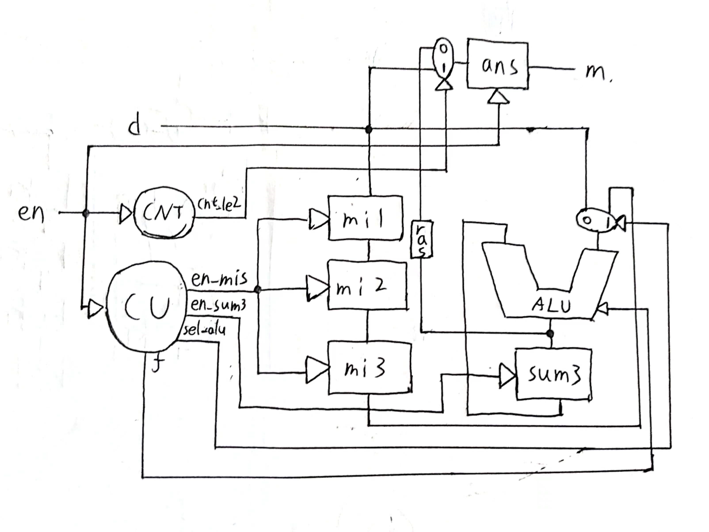
  - 注：圆形为FSM，方形为寄存器，椭圆形为选择器；带有三角形的为控制信号输入；不带有三角形的，左侧或上侧的为数据输入，右侧或下侧的为数据输出。

- 代码如下：

  - ``` verilog
    module  mav (
        input  clk, 
        input  rstn, 
        input  en,
        input  [15:0]  d,
        output [15:0]  m
    );  
        wire [15:0] alu_out, mi1_out, mi2_out, mi3_out, cnt_out, sum3_out;
        // debounce DB_EN(.x(en), .clk(clk), .rstn(rstn), .y(en_db));
        assign en_db = en; // no debounce need while testing
        register #(.WIDTH(1)) EN_LS (.clk(clk), .rstn(rstn), .en(1), .d(en_db), .q(en_ls));
        assign en_ps = ~en_ls & en_db; 
    
        cnt CNT(.clk(clk), .rstn(rstn), .en(en_ps), .cnt_le2(cnt_le2));
        
        register #(.WIDTH(16)) ANS (.clk(clk), .rstn(rstn), .en(en_ps), .d(cnt_le2 ? d : {{2{alu_out[15]}}, alu_out[15:2]}), .q(m));
        register #(.WIDTH(16)) MI1 (.clk(clk), .rstn(rstn), .en(en_mis), .d(d), .q(mi1_out));
        register #(.WIDTH(16)) MI2 (.clk(clk), .rstn(rstn), .en(en_mis), .d(mi1_out), .q(mi2_out));
        register #(.WIDTH(16)) MI3 (.clk(clk), .rstn(rstn), .en(en_mis), .d(mi2_out), .q(mi3_out));
        register #(.WIDTH(16)) SUM3 (.clk(clk), .rstn(rstn), .en(en_sum3), .d(alu_out), .q(sum3_out));
    
        wire [2:0] f, t;
        alu #(.WIDTH(16)) ALU(.a(sum3_out), .b(sel_alu_b ? mi3_out : d), .f(f), .y(alu_out), .t(t));
    
        cu   CU(.clk(clk), .rstn(rstn), .en(en_ps), .sel_alu_b(sel_alu_b), .en_mis(en_mis), .en_sum3(en_sum3), .f(f));
    endmodule
    ```
    
  - ``` verilog
    module cnt(
        input  clk, 
        input  rstn, 
        input  en,
        output cnt_le2
    );
        reg [1:0] cnt_cs, cnt_ns;
        always @(posedge clk, negedge rstn) begin
            if (!rstn) begin
                cnt_cs <= 0;
            end
            else
                cnt_cs <= cnt_ns;
        end
    
        always @(*) begin
            cnt_ns = cnt_cs;
            case (cnt_cs)
                0: if (en) cnt_ns = 1;
                1: if (en) cnt_ns = 2;
                2: if (en) cnt_ns = 3;
            endcase
        end
    
        assign cnt_le2 = (cnt_cs != 3);
    endmodule
    ```

  - ``` verilog
    module cu(
        input clk, rstn, en,
        output reg sel_alu_b,
        output reg en_mis, en_sum3,
        output reg [2:0] f
    );
        
        reg cs, ns;
        parameter S0 = 1'd0, S1 = 1'd1;
        parameter f_sub = 3'd0, f_add = 3'd1;
    
        always @(posedge clk, negedge rstn) begin
            if (!rstn) begin
                cs <= 0;
            end
            else cs <= ns;
        end
    
        always @(*) begin
            ns = cs;
            sel_alu_b = 0;
            en_mis = 0; en_sum3 = 0;
            f = 0;
            case(cs) 
                S0: begin
                    sel_alu_b = 0; f = f_add; // sum3 + d
                    if (en) begin
                        en_sum3 = 1;
                        ns = S1;
                    end
                    else ns = S0;
                end
    
                S1: begin
                    sel_alu_b = 1; f = f_sub; // sum3 - mi3
                    en_sum3 = 1;
                    en_mis = 1; // shift mi1 to mi3
                    ns = S0;
                end
            endcase
        end
    endmodule
    ```

### 3.ALU_TEST模块设计

- 由于七段数码管只能显示8位16进制数，仿照上学期数电实验labH5，进行如下设计：

  - ALU的五个端口各接一个寄存器，输出接数码管显示。
  - `cl`，`cr`切换当前数码管显示内容，共有`a`，`b`，`f`，`y`四种状态，分别对应指示灯0-3。而`t`输出较短，直接对应最左侧三个指示灯。
  - 在前三种状态下，如果推上开关`sw[i]`，当前数`a`将会变为`(a<<4)+i`，即十六进制下左移一位，并填充新输入的数值。注意`f`只有三位，故此时效果等同于`f=i[3:0]`。
  - 这些功能可以用一个简单的状态机实现，部分思路与上学期实验相似。七段数码管显示直接复用了上学期的代码。

- 代码如下：

  - ```verilog
    module alu_test(
        input [15:0] sw,
        input cl, cr,
        input clk, rstn,
        output reg [3:0] state,
        output     [2:0] t_out,
        output     [6:0] cn,
        output     [7:0] an
        );
        reg en_a, en_b, en_f;
        reg  [31:0] a_in, b_in;
        wire [31:0] a_out, b_out, alu_out;
        reg  [2:0] f_in;
        wire [2:0] f_out;
        register #(.WIDTH(32)) REG_A (.clk(clk), .rstn(rstn), .en(en_a), .d(a_in), .q(a_out));
        register #(.WIDTH(32)) REG_B (.clk(clk), .rstn(rstn), .en(en_b), .d(b_in), .q(b_out));
        register #(.WIDTH(3)) REG_F (.clk(clk), .rstn(rstn), .en(en_f), .d(f_in), .q(f_out));
    
        wire [2:0] t;
        alu #(.WIDTH(32)) ALU(.a(a_out), .b(b_out), .f(f_out), .t(t), .y(alu_out));
        register #(.WIDTH(3)) REG_T (.clk(clk), .rstn(rstn), .en(1), .d(t), .q(t_out));
    
        wire [15:0] sw_ps;
        wire [3:0] hd;
        take_posedge #(.WIDTH(16)) PS_SW (.x(sw), .clk(clk), .rstn(rstn), .y(sw_ps));
        encoder16_4 ECD(.in(sw_ps), .f(ipt), .out(hd));
    
        reg [1:0] sel_ddp;
        wire [31:0] ddp_in;
        selector4 #(.WIDTH(32)) SEL_DDP(.in0(a_out), .in1(b_out), .in2({29'd0, f_out}), .in3(alu_out), .sel(sel_ddp), .out(ddp_in));
    
        dynamic_display DDP(.clk(clk), .rstn(rstn), .d(ddp_in), .an(an), .cn(cn));
    
        debounce DB_cl(.x(cl), .clk(clk), .rstn(rstn), .y(cl_db));
        take_posedge PE_cl(.x(cl_db), .clk(clk), .rstn(rstn), .y(cl_ps));
        debounce DB_cr(.x(cr), .clk(clk), .rstn(rstn), .y(cr_db));
        take_posedge PE_cr(.x(cr_db), .clk(clk), .rstn(rstn), .y(cr_ps));
    
        
        parameter S0 = 2'd0, S1 = 2'd1, S2 = 2'd2, S3 = 2'd3;
        reg [1:0] cs, ns;
    
        always @(posedge clk, negedge rstn) begin
            if (!rstn) cs <= S0;
            else cs <= ns;
        end
    
        always @(*) begin
            ns = cs;
            en_a = 0; en_b = 0; en_f = 0;
            a_in = a_out; b_in = b_out; f_in = f_out;
            sel_ddp = 0;
            state = 4'b0001;
            case (cs)
                S0: begin
                    sel_ddp = 0;
                    state = 4'b0001;
                    if (ipt) begin
                        en_a = 1; a_in = {a_out[27:0], hd};
                    end
                    if (cl_ps) ns = S3;
                    else if (cr_ps) ns = S1;
                end
    
                S1: begin
                    sel_ddp = 1;
                    state = 4'b0010;
                    if (ipt) begin
                        en_b = 1; b_in = {b_out[27:0], hd};
                    end
                    if (cl_ps) ns = S0;
                    else if (cr_ps) ns = S2;
                end
    
                S2: begin
                    sel_ddp = 2;
                    state = 4'b0100;
                    if (ipt) begin
                        en_f = 1; f_in = hd[2:0];
                    end
                    if (cl_ps) ns = S1;
                    else if (cr_ps) ns = S3;
                end
    
                S3: begin
                    sel_ddp = 3;
                    state = 4'b1000;
                    if (cl_ps) ns = S2;
                    else if (cr_ps) ns = S0;
                end
            endcase
        end
    endmodule
    ```


## 仿真结果与分析

### 1.ALU仿真

- 首先使用手动构造的几组数据做初步检验：

  - ``` verilog
    module alu_tb_handmade;
        reg signed [31:0] a, b;
        reg [2:0] f;
        wire [31:0] y;
        wire [2:0] t;
    
        alu #(.WIDTH(32)) ALU (.a(a), .b(b), .f(f), .y(y), .t(t));
    
    
        initial begin
            // binary and decimal aritmetic test
            a = 5; b = 11; 
            f = 0; #1; f = 1; #1; f = 2; #1; f = 3; #1; f = 4; #1;
            a = 3; b = -4; 
            f = 0; #1; f = 1; #1; f = 2; #1; f = 3; #1; f = 4; #1;
            a = -5; b = -7; 
            f = 0; #1; f = 1; #1; f = 2; #1; f = 3; #1; f = 4; #1;
            a = 6; b = 6; 
            f = 0; #1; f = 1; #1; f = 2; #1; f = 3; #1; f = 4; #1;
    
            #2;
    
            // binary shift test
            a = 32'b1010_1001; b = 4;
            f = 5; #1; f = 6; #1; f = 7; #1;
            a = 32'b1111_1111_1111_1111_1111_1111_1011_0000; b = 8;
            f = 5; #1; f = 6; #1; f = 7; #1;
        end
    endmodule
    ```

  - 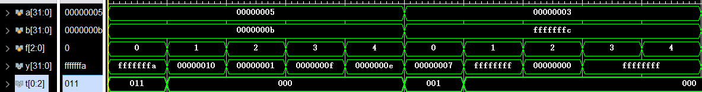

  - 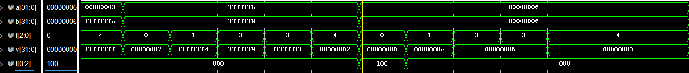

  - 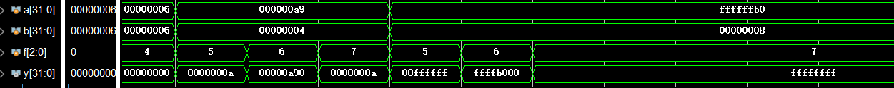

- 之后随机生成数据（可以配合计算机验证）

  - ``` verilog
    module alu_tb;
        reg [31:0] a, b;
        reg [2:0] f;
        wire [31:0] y;
        wire [2:0] t;
    
        alu #(.WIDTH(32)) ALU (.a(a), .b(b), .f(f), .y(y), .t(t));
    
        integer seed = 100;
    
        initial begin
                forever begin
                a = $random();
                f = $random();
                b = $random();
                if (f >= 5) begin
                    b = b[4:0];
                end
                #5;
            end
        end
    endmodule
    ```

  - 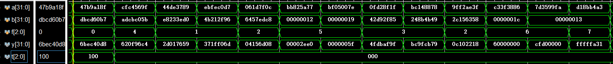

### 2.MAV仿真

- 该部分仿真有两个目的，分析模块的正确性，以及确认是否能在当周期立即得到结果。
  - 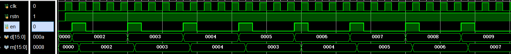
  - 可以发现满足要求。

### 3.ALU_TEST模块

由于ALU已经经过测试，此部分不做仿真，直接上板测试。

## 电路设计与分析

### 1.ALU模块

- RTL电路图：
  - 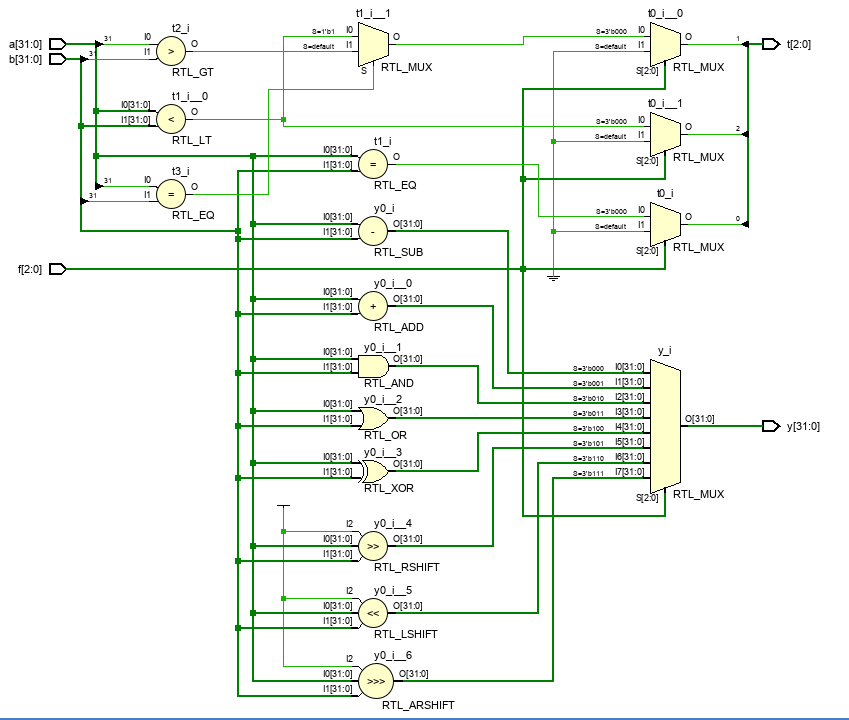

- 资源使用：（非时序电路，无Time Report）
  - 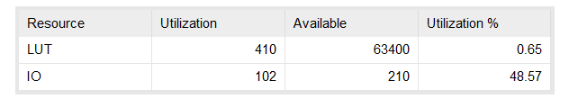


### 2.MAV模块

- RTL电路图：（大图，可放大）
  - 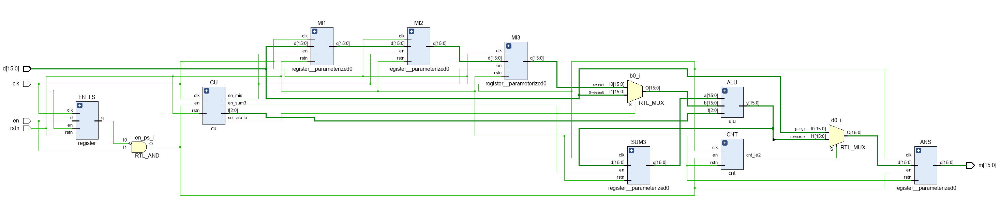
- 时间情况：
  - 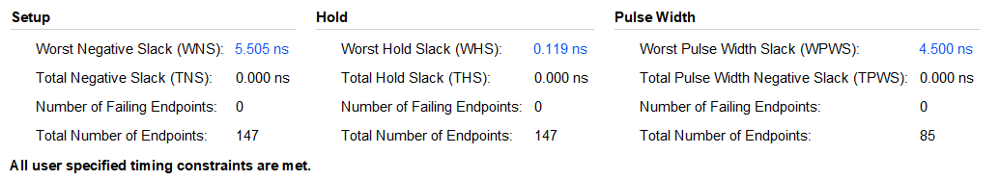
- 资源使用：
  - 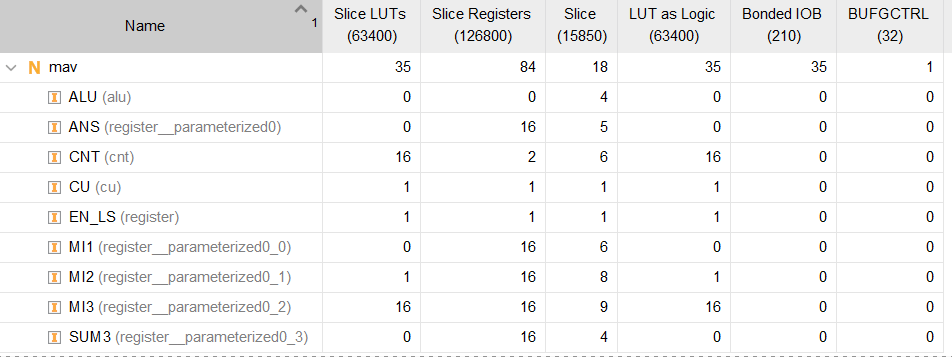

### 3.ALU_TEST模块

- 此部分由于状态机未单独提取出，RTL电路图较杂乱，不再展示。
- 时间性能如下：
  - 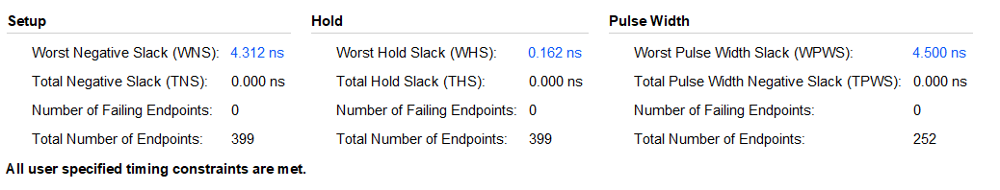
- 使用资源如下：
  - 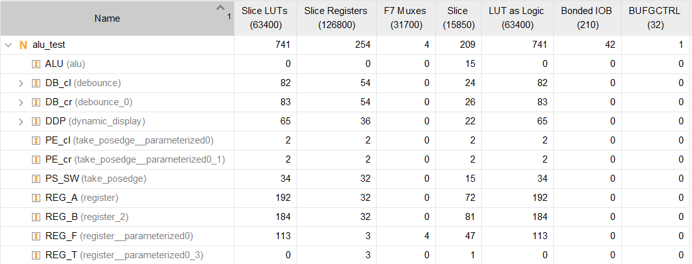
- 注意：这里的时间和资源情况是整个模块的情况。如果想要单独考虑ALU的情况，应该考虑像数电实验labH1一样，给输入输出接上寄存器后，调整时钟周期直接跑综合、实现。

## 测试结果与分析

### 1.MAV上板测试

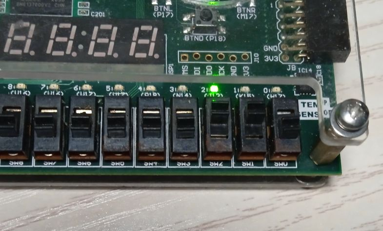

与PPT中相同输入顺序，输入到6时，结果为4.

### 2.ALU_TEST上板测试

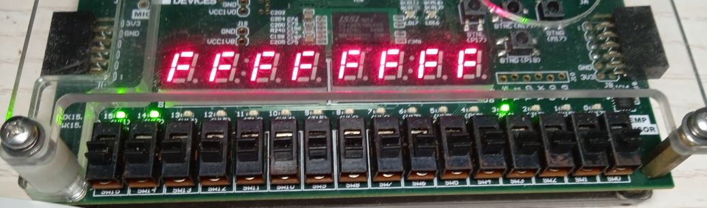

这是第一个操作数为2，第二个操作数为3，功能为0（减法+比较）时的输出。

## 总结

- 本次实验完成了ALU模块及其上板测试，并利用ALU实现了求4个数的滑动平均。
- 这次实验总体给人的感觉是上来就上强度了。看起来本次实验内容不多，实际上很多地方实现很有难度。