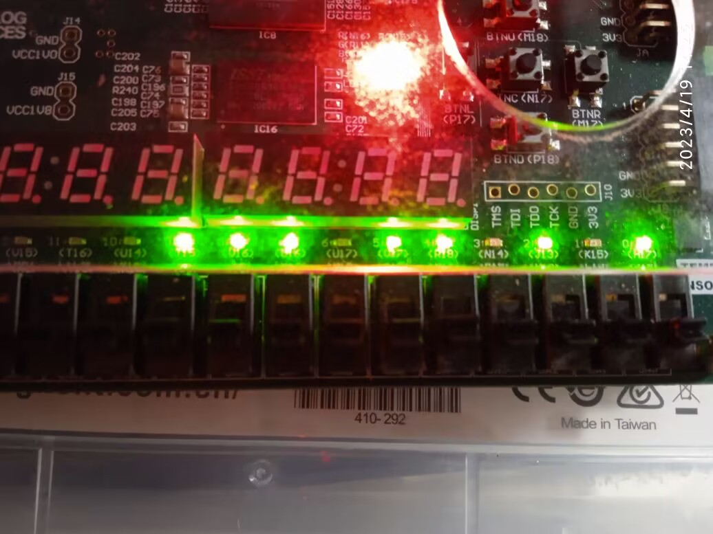

# LabH2 report

**PB21000039 陈骆鑫**


## 实验目的与内容

1. 在PPT提供寄存器堆模块的基础上修改，使其满足RISC-V的要求。
2. 实现对分布式存储双端口器的排序，并结合串行调试模块SDU_DM调试。

## 逻辑设计

1. 寄存器堆设计：

   - 已经给出了代码主体，只需要使0号寄存器始终为0。这部分较为简单，只要对读/写地址特判，在为0时输出0/不做操作。

     - ```verilog
       module  register_file (
           input         clk,		//时钟
           input  [4:0]  ra1, ra2,	//读地址
           output [31:0] rd1, rd2,	//读数据
           input  [4:0]  wa,		//写地址
           input  [31:0] wd,	    //写数据
           input         we		//写使能
       );
           reg [31:0] rf[1:31]; 	//寄存器堆
       
           assign rd1 = ra1 ? rf[ra1] : 0; 	//读操作
           assign rd2 = ra2 ? rf[ra2] : 0;
       
           always @(posedge clk)
               if (we)
                   if (wa) rf[wa] <= wd;   //写操作
       endmodule
       ```

2. 排序模块

   - 类似数电实验，仍选择较为容易实现的冒泡排序。

   - 为了更容易实现，这里选择进一步修改后的（或者说另一种版本的）冒泡排序，C语言伪代码如下：

     - ``` c
       bool flag = true;
       while (flag) {
           flag = false;
           for (int i = 1; i < n; i++) {
               if (a[i] > a[i + 1]) {
                   flag = true;
                   int t = a[i];
                   a[i] = a[i + 1];
                   a[i + 1] = t;
               }
           }
       }
       ```

   - 修改为数字系统描述，设计出状态转换图如下：

     - 

   - 仍然使用结构化的数据通路描述方式。与状态转换图对应的数据通路如下：（避免图较乱，没有对数据连线）

     - 

   - 注意要与SDU_DM结合，需要根据是否完成排序（即done信号），对存储器的输入信号进行选择（输出可以共用）。这部分可最终在最外层完成，没有在数据通路图上体现出来。

   - 另外，需要对时钟周期计数。这部分可使用单独的一个计数器实现。

     - 由于冒泡排序效率较低且数据量较大，实际显示的是时钟周期数右移8位后的值。

   - 控制单元代码如下：

     - 如果采用原方案，综合后发现延时超过时钟周期，主要是因为存储器过大影响了布线，产生了很大的线延迟（关键路径10ns，线延迟7ns以上）。为了方便，直接更改了状态行为，不在S3判断状态转移，而直接进入S4、S5，并在S4、S5根据已经读取出的数据判断是否写数据。这样做使得最后时间要求得以满足，但时钟周期数增加了。

       - （实际上这样也有优化的空间，但我没有进一步去更改）

     - ``` verilog
       module control_unit(
           input  clk, rstn, run,
           input  loop_bound, rev_order, flag_out,
           output reg sel_dpra, en_n,
           output reg en_flag, flag_in,
           output reg en_i, sel_i,
           output reg sel_a,
           output reg en_p, en_q,
           output reg sel_d,
           output reg srt_we,
           output reg done_rev
           );
       
           reg [2:0] cs, ns;
       
           parameter S0 = 3'd0, S1 = 3'd1, S2 = 3'd2, S3 = 3'd3, S4 = 3'd4, S5 = 3'd5, S6 = 3'd6, S7 = 3'd7;
       
           always @(posedge clk, negedge rstn) begin
               if (!rstn) cs <= S0;
               else cs <= ns;
           end
       
           always @(*) begin
               ns = cs;
               sel_dpra = 0; en_n = 0;
               en_flag = 0; flag_in = 0;
               en_i = 0; sel_i = 0;
               sel_a = 0;
               en_p = 0; en_q = 0;
               sel_d = 0;
               srt_we = 0;
               done_rev = 0;
               case (cs) 
                   S0: begin
                       if (run) begin
                           ns = S1;
                       end
                       else ns = S0;
                   end
       
                   S1: begin
                       done_rev = 1;
                       ns = S2;
                   end
       
                   S2: begin
                       en_flag = 1; flag_in = 0;
                       en_i = 1; sel_i = 0;    // i = 1
                       sel_dpra = 1; en_n = 1; // n = mem[0]
                       ns = S3;
                   end
       
                   S3: begin
                       sel_a = 0; sel_dpra = 0; // i and i + 1
                       en_p = 1; en_q = 1;
                       ns = S4;
                   end
       
                   S4: begin
                       if (rev_order) begin
                           en_flag = 1; flag_in = 1;
                       end
                       sel_a = 0; sel_d = 1; // mem[i] = q
                       srt_we = rev_order;
                       ns = S5;
                   end
       
                   S5: begin
                       sel_a = 1; sel_d = 0; // mem[i + 1] = p
                       srt_we = rev_order;
                       ns = S6;
                   end
       
                   S6: begin
                       en_i = 1; sel_i = 1;
                       if (loop_bound) begin
                           if (flag_out) ns = S2;
                           else ns = S7;
                       end
                       else ns = S3;
                   end
       
                   S7: begin
                       done_rev = 1;
                       ns = S0;
                   end
               endcase
           end
       endmodule
       ```
   
   - 数据通路代码如下：
   
     - ```verilog
       module sort (
           input  clk, 		    // 时钟
           input  rstn, 		    // 复位
           input  run,		        // 启动排序
           output reg done,		// 排序结束标志
           output [15:0] cycles,	// 排序耗费时钟周期数
       
           // SDU_DM接口
           input  [31:0] addr,	    // 读/写地址
           output [31:0] dout,	    // 读取数据
           input  [31:0] din,	    // 写入数据
           input  we,		        // 写使能
           input  clk_ld		    // 写时钟
       );  
           wire [31:0] spo, dpo;
           wire [31:0] i_out, p_out, q_out, n_out;
       
           wire en_i, sel_i;
           register #(
               .WIDTH(32)
           ) REG_I (
           	.clk  (clk),
               .rstn (rstn),
               .en   (en_i),
               .d    (sel_i ? i_out + 1: 1),
               .q    (i_out)
           );
       
           wire en_p;
           register #(
               .WIDTH(32)
           ) REG_P (
           	.clk  (clk),
               .rstn (rstn),
               .en   (en_p),
               .d    (spo),
               .q    (p_out)
           );
       
           wire en_q;
           register #(
               .WIDTH(32)
           ) REG_Q (
           	.clk  (clk),
               .rstn (rstn),
               .en   (en_q),
               .d    (dpo),
               .q    (q_out)
           );
       
           wire en_n;
           register #(
               .WIDTH(32)
           ) REG_N (
           	.clk  (clk),
               .rstn (rstn),
               .en   (en_n),
               .d    (dpo),
               .q    (n_out)
           );
       
           wire en_flag, flag_in, flag_out;
           register #(
               .WIDTH(1)
           ) REG_FLAG (
           	.clk  (clk),
               .rstn (rstn),
               .en   (en_flag),
               .d    (flag_in),
               .q    (flag_out)
           );
       
           wire [31:0] a_in, d_in, dpra;
           wire sel_a, sel_d, sel_dpra;
           wire srt_we;
           assign a_in = (done ? addr : (sel_a ? (i_out + 1): i_out));
           assign d_in = sel_d ? q_out : p_out;
           assign dpra = sel_dpra ? 0 : (i_out + 1);
           
           dist_mem_gen_0 DM (
               .a(a_in[7:0]),                  // input wire [7:0] a
               .d((done ? din : d_in)),        // input wire [31:0] d
               .dpra(dpra[7:0]),               // input wire [7:0] dpra
               .clk(done ? clk_ld : clk),      // input wire clk
               .we(done ? we : srt_we),        // input wire we
               .spo(spo),                      // output wire [31:0] spo
               .dpo(dpo)                       // output wire [31:0] dpo
           );
       
           assign dout = spo;
       
           wire loop_bound, rev_order;
       
           assign loop_bound = (i_out == n_out - 1);
           assign rev_order = (p_out > q_out);
       
           wire run_ps;
           
           take_posedge  PS_RUN(
           	.x    (run),
               .clk  (clk),
               .rstn (rstn),
               .y    (run_ps)
           );
           
           wire done_rev;
           
           control_unit CU(
           	.clk        (clk),
               .rstn       (rstn),
               .run        (run_ps),
               .loop_bound (loop_bound),
               .rev_order  (rev_order),
               .flag_out   (flag_out),
               .sel_dpra   (sel_dpra),
               .en_n       (en_n),
               .en_flag    (en_flag),
               .flag_in    (flag_in),
               .en_i       (en_i),
               .sel_i      (sel_i),
               .sel_a      (sel_a),
               .en_p       (en_p),
               .en_q       (en_q),
               .sel_d      (sel_d),
               .srt_we     (srt_we),
               .done_rev   (done_rev)
           );
       
           always @(posedge clk, negedge rstn) begin
               if (!rstn) begin
                   done <= 1;
               end
               else done <= done ^ done_rev;
           end
       
           cycle_counter CCNT(
           	.clk    (clk),
               .rstn   (rstn),
               .done   (done),
               .cycles (cycles)
           );
       endmodule
       ```
       
     - 这不是最外层模块，最外层模块负责与SDU_DM结合。

## 仿真结果与分析

1. 对寄存器堆的仿真：
   - 这部分仿真主要是为了确认时序的正确性以及对0号寄存器处理的正确性。
   - 
2. 对排序的仿真：
   - 这部分的仿真较为复杂，主要是在结果不正确时，确认出现错误的第一个位置；在此只展示一部分。
   - 

## 电路设计与分析

1. 寄存器堆：
   - 
   - 可以看到至少在寄存器堆这个程序中，vivado还是比较智能的，成功理解了我的想法……

2. 排序模块：
   - 生成的RTL电路图比较杂乱……
     
   - 时间情况：
     - 
   - 资源使用情况
     - 

## 测试结果与分析

- 电脑端显示如下：
  - 
  - 前两行是排序前的输出，后两行为排序后。
- 显示的排序用时如下：（右移后的）
  - 

## 总结

- 上学期数电实验已经做过了类似的内容，所以这次实验本身内容不算难。
  - 但是提供的SDU模块是个巨无霸，导致满足时间要求变得困难了一些。