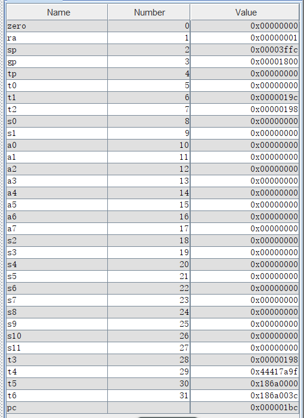
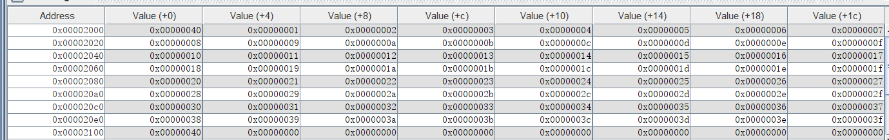

# LabH3 report

**PB21000039 陈骆鑫**


## 实验目的与内容

1. 提供对要求的18条指令的逐指令测试程序；
2. 使用提供指令完成排序程序，以进行进一步测试。


## 逻辑设计

1. 逐指令测试：
   - PPT中已经给出了测试逻辑，按其完成即可。
   - 结果返回方式如下：依最后ra寄存器的值而定，1代表成功，0代表失败。

2. 排序程序：
   - 由于已经上升到了软件层面，使用更高效的排序算法。这里选择堆排序。

   - 算法参考严蔚敏《数据结构》一书。C语言代码如下：

     ``` c
     int *a;
     void heap_adjust(int s, int n){
         int j = 2 * s, t = a[s];
         while (j <= n) {
             if (j < n){
                 if (a[j + 1] > a[j]) {
                     j++;
                 }
             }
             if (t > a[j]) break;
             a[s] = a[j];
             s = j;
             j *= 2;
         }
         a[s] = t;
         return;
     }
     
     int main(){
         *a = {7, 5, 3, 1, 4, 7, 2, 6};
         int n = a[0];
         i = n / 2;
         while (i > 0){
             heap_adjust(i, n);
             i--;
         }
         i = n;
         while (i > 1){
             swap(a[1], a[i]);
             i -= 1;
             heap_adjust(1, i);
         }
     }
     ```

   - 将其转写为汇编语句即可。注意数据长度为32，长为4个字节；注意可以使用的指令有限，需要改变部分位置的边界判断方式。

## 测试结果与分析

- 测试程序在RARS环境下，最终返回值为1：
  - 
- 排序程序将预置的数据成功排序。
  - 