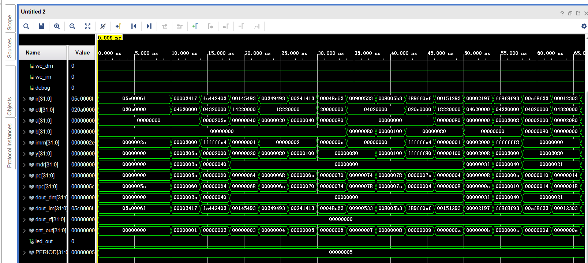
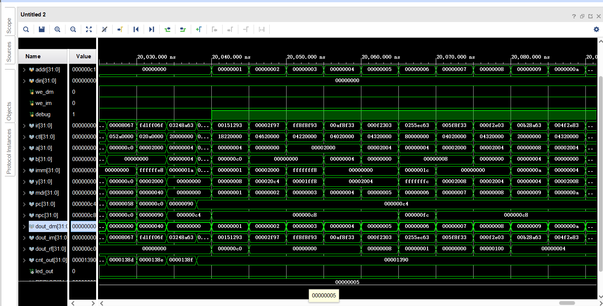
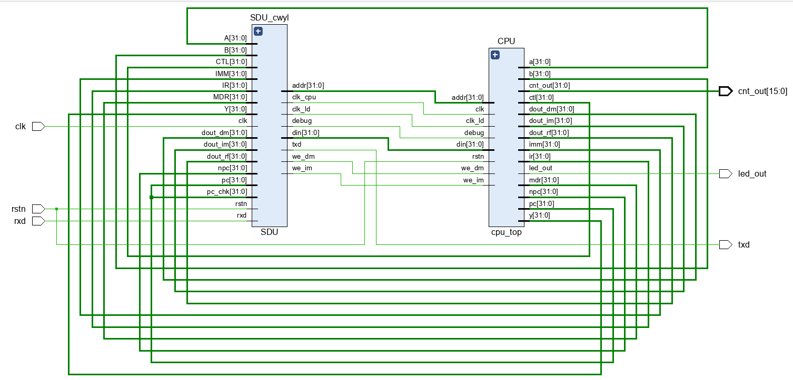
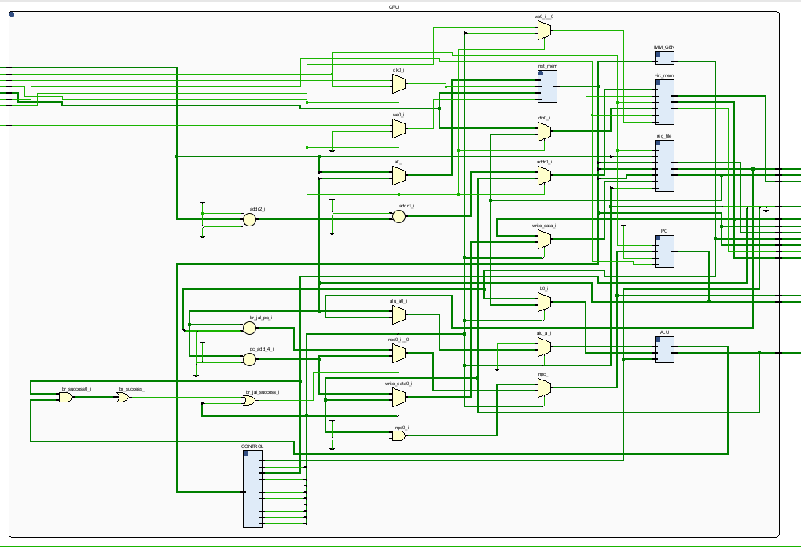
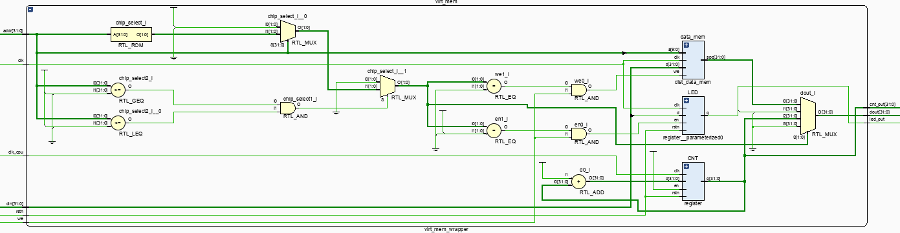
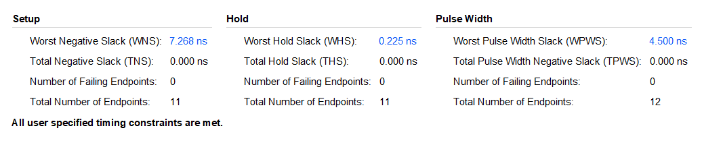
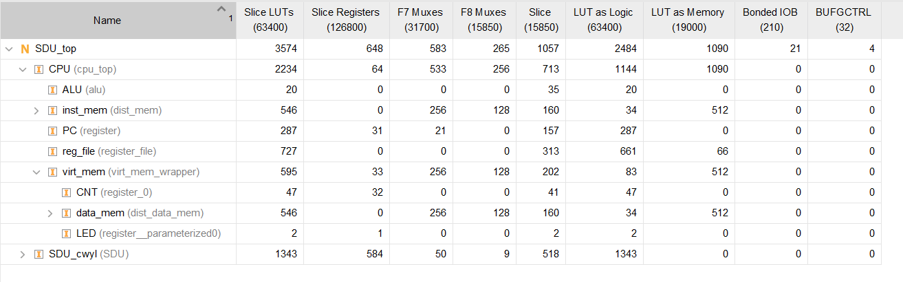
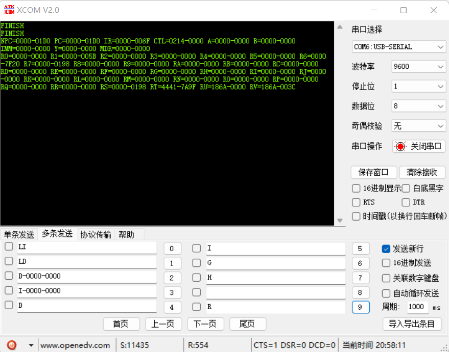
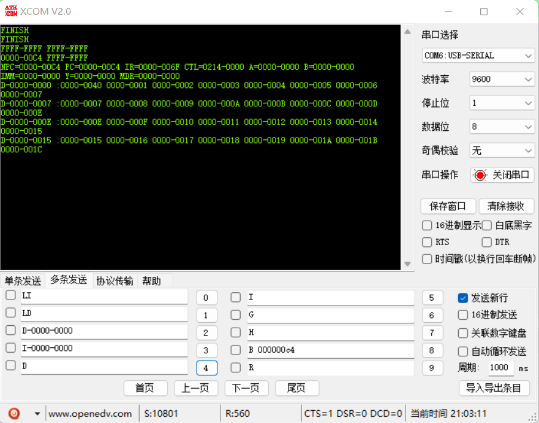

# LabH4 report

**PB21000039 陈骆鑫**


## 实验目的与内容

实现一个简单的RISC-V单周期32位CPU，支持LabH3中使用的18条指令。


## 逻辑设计

- PPT中给出的参考为COD课内教学用的简单CPU数据通路和逻辑设计。这个CPU比我们要实现的还要简单的多，例如分支操作和ALU操作分别均只支持一种，也不支持jal、auipc等操作。因此这个数据通路显然是不能使用的，我们在这张图的基础上做修改。总结这18条指令的规律，我们在此数据通路上要更改以下部分：

  - 要支持lui和auipc两条指令，alu操作数1不能始终为rs1了；需要另外加入0和pc两种操作数1，由控制信号is_lui和is_auipc选择。
  - 要支持三种不同的branch指令，不能简单地由is_branch单一控制信号和zero单一比较信号确定是否跳转。为了方便，我们将控制分支的控制信号调整为br_flags[2:0]，为了与alu输出对应，0到2三位分别代表是否为beq、blt、bltu指令；这样，直接将br_flags与alu比较输出与、缩位或之后，就能知道是否执行跳转。
  - 另外要支持jar和jalr两种指令。首先注意这两种指令有一个共同点，需要把pc+4保存到寄存器，因此需要给寄存器写入值加入pc+4选择，用ra_to_reg控制信号控制。另外，jal的跳转方式与branch相同，但jalr不同使用的alu输出获取npc的值。因此，npc也要增加alu输出的选择，由is_jalr控制信号控制。
  - 注意一个小细节：由于不同的指令会共用opcode，控制单元不能再只使用ir[6:0]（opcode段）作为输入。

- 对于内存读写部分，注意以下细节：

  - RISC-V使用字节寻址，而我们的存储器为32位，因此使用cpu内部产生的地址寻址时，需要右移两位。
  - 要求实现一个简单的MMIO，包括一个LED与一个计数器。我们将数据存储器与两个寄存器结合，使用类似存储器片选的思路，根据输入地址的范围决定对不同部分读取、写入。

- 在与SDU结合时，需要注意存储器的复用问题。SDU为我们提供了debug信号，我们需要根据此信号选择不同的时钟与输入、输出。

- 注意以上细节之后，整体的实现思路较清晰，代码附在附件中。

  - 全部控制信号的定义如下：

    ```verilog
    // 15 bits
        assign ctl = {br_flags[2:0], alu_op[2:0], is_jal, is_jalr, is_lui, is_auipc, alu_src, mem_to_reg, ra_to_reg, mem_write, reg_write, 17'b0};
    ```


## 仿真结果与分析

- 将指令存储器和数据存储器的初始值设为LabH3导出的排序文件，启动cpu_top模块的仿真。（仿真文件采用自动化方式生成框架，并补充逻辑细节）

  - CPU运行时的截图如下：

    

  - CPU运行到结束位置后，仿真文件会自动停止CPU，并将debug置为1，开始遍历数据存储器。关注数据存储器dout_dm一行，可以看到数据已经升序排列。

    

## 电路设计与分析

- 整体RTL电路图如下，符合预期：

  

- 由于部分组合电路，CPU生成的RTL电路图较复杂，但也能看出大致结构：

  

- 其余部分电路中一部分是前面的实验实现的，另外一部分多为较复杂的组合电路。我们这里重点关注负责数据存储器和MMIO的virt_mem模块，可以看到清晰的片选模式：

  

- 时间情况如下：

  

- 资源使用如下：

  

## 测试结果与分析

- 运行指令测试程序：
  - 程序成功运行到结束，并将成功状态写入到LED中。
  - 
  - 
- 运行排序程序：
  - 程序成功在断点处停止，并且数据存储器中数据确为生序排列（0地址处数据为数组大小）。
  - 

## 总结

- 这次实验的工作量较大，细节较多，但相对之前有较完整的数据通路和实现方案，在设计完成后可以较为按部就班地完成整个CPU。