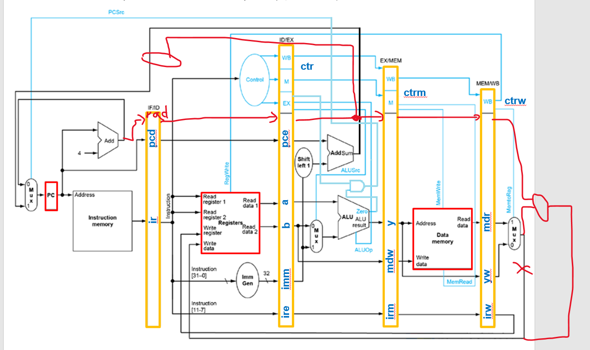
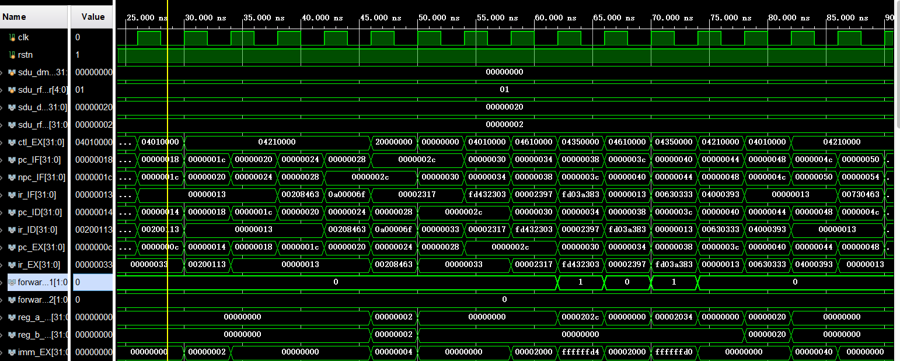
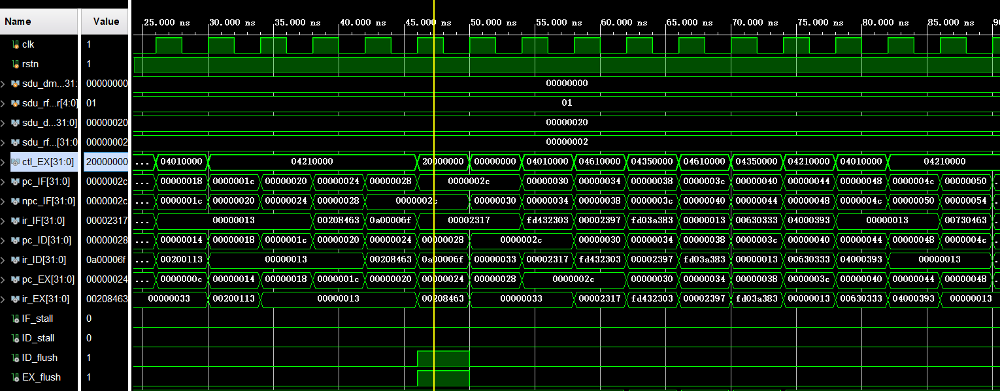
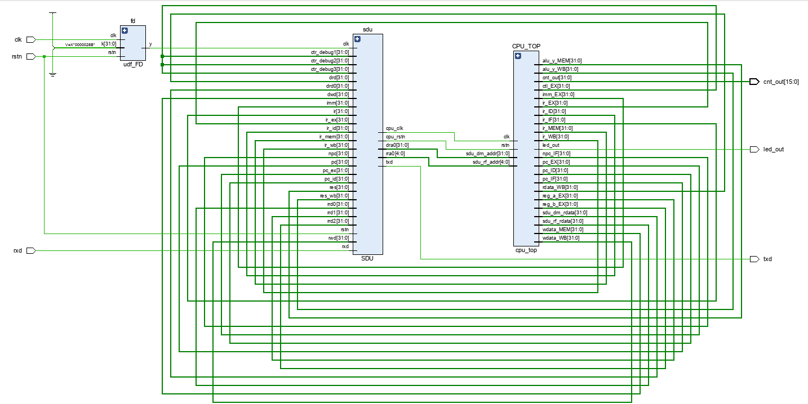
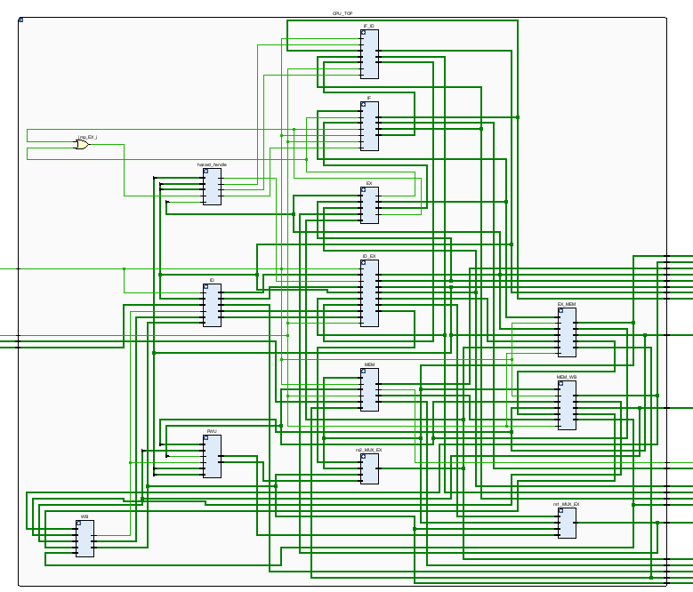
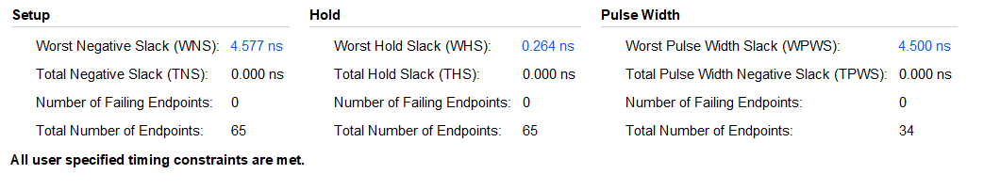
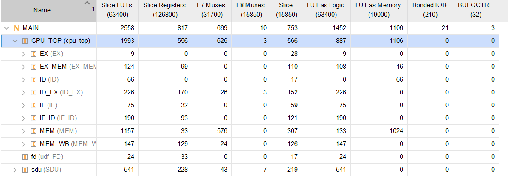

# LabH5 report

**PB21000039 陈骆鑫**


## 实验目的与内容

- 实现与上次实验功能相同的五级流水线CPU，要求对数据和控制相关进行处理，能够正确工作。


## 逻辑设计

- 与上一次实验相同，PPT（课本）提供了一个简单的设计框架，我们也要在此基础上支持新的指令。大部分的更改与上次实验类似：

  - 对aui、luipc以及不同branch指令的支持，沿用上次实验的数据通路、控制信号修改即可。

  - 同样，jal和jalr要求新的选择器和新的控制信号。但要注意的是，jalr要在WB阶段将PC+4存入寄存器；而当前的数据通路，在WB段已经丢失了与PC相关的信息，因此我们需要将PC或者PC+4向后传递。为了避免加入额外的寄存器，这里我选择将PC+4向后传到WB阶段。

    - 一部分修改的示意图如下：
      

  - 对于大部分单元，可以沿用上次实验的内容；但注意上次实验由于使用存储器的特性，略去了MemRead信号；而实现Load-Use Hazard的检测，需要该信号。因此，控制信号的定义修改如下：

    ```verilog
    assign ctl = {
            br_flags[2:0],          // [31:29]
            alu_op[2:0],            // [28:26]
            is_jal, is_jalr,        // [25], [24]
            is_lui, is_auipc,       // [23], [22]
            alu_src,                // [21]
            mem_to_reg, ra_to_reg,  // [20], [19]
            mem_read, mem_write,    // [18], [17]
            reg_write,              // [16]
            16'b0
        };
    ```

- 对于具体实现，为了方便编写与调试，采用结构化的描述方式。CPU整体由`IF`、`IF/ID`、`ID`、`ID/EX`、`EX`、`EX/MEM`、`MEM`、`MEM/WB`、`WB`九个部分组成；这九个模块间的大部分耦合存在于相邻两部分之间，减小了级间耦合。此外，为了处理数据和结构相关，加入了`Forwarding Unit`和`Hazard Handle`两个模块。

  - `Forwarding Unit`和`Hazard Handle`的实现直接参考教材提供的思路；`flush`/`stall`的具体处理参考PPT。

- 使用结构化的描述方式后，实现思路较为清晰；代码附在附件中。


## 仿真结果与分析

- 由于项目整体结构较复杂，虽然有SDU模块，绝大部分调试工作仍应该在仿真中完成。
  - 仿真文件框架由自动化工具生成。为了更加细粒度的调试，看到更低一级结构的错误，选择在testbench文件中复制CPU顶层模块的代码。
- 仿真结果如下：
  - 
    - 从几个阶段PC的变化，可以看出流水线的执行模式；
    - 前递信号为`forward_rs1`/`forward_rs2`。`reg_a_EX`/`reg_b_EX`是提供给ALU的最终输入值；由前递信号以及`reg_a_EX`的值，可以看出前递起了作用。
  - 
    - `IF_stall`/`ID_stall`/`ID_flush`/`EX_flush`是处理`Load-Use Hazard`/`Branch Hazard`单元的输出信号。由输出信号以及PC的变化情况，可以看到处理单元起了作用。
- 三个测试在仿真中均达到了期望的结果。


## 电路设计与分析

- 整体的RTL电路图符合期望：
  
  - CPU模块的RTL电路图仍然十分复杂；显然虽然我已经尽量采用了结构化的描述方式，工具仍然并没有理解我的意图。
    
- 时间和资源情况如下：
  
  


## 总结

- 这次实验本来预计需要相当长的时间，没想到实际上花的时间比单周期CPU还短。究其原因，应该是一部分有工作量的内容已经在之前完成过了，可以直接利用，剩下的大部分工作是重复地实例化模块；而数据、结构相关的部分虽然理解上比较难，但编码内容并不多。