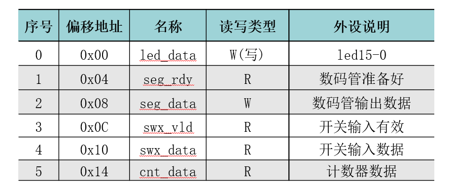
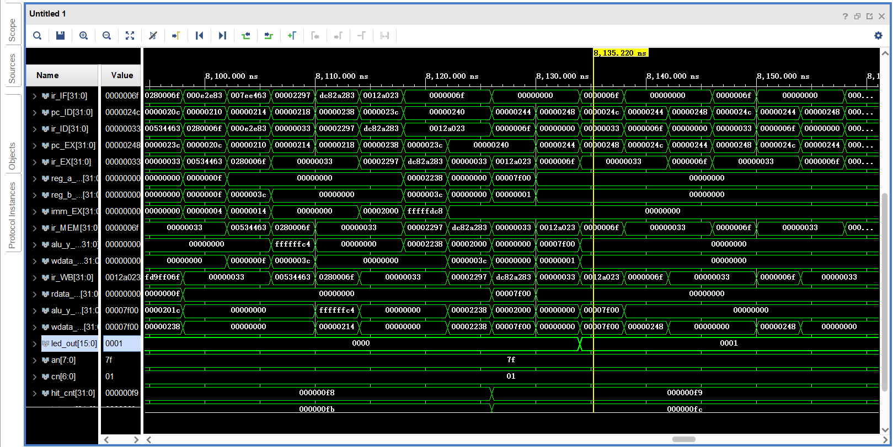
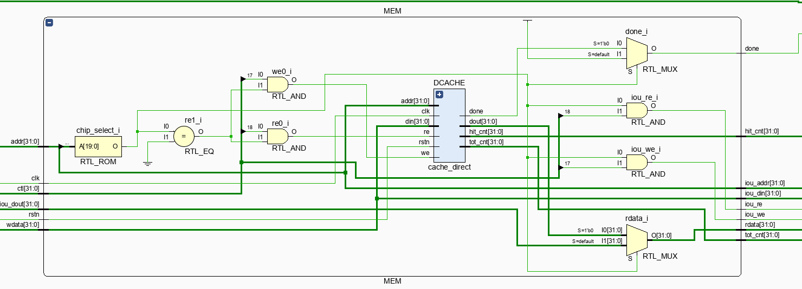
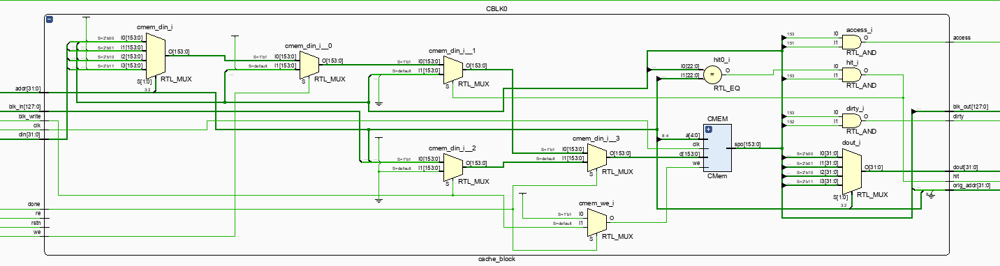
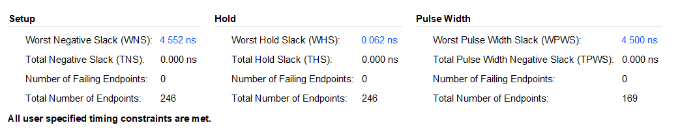
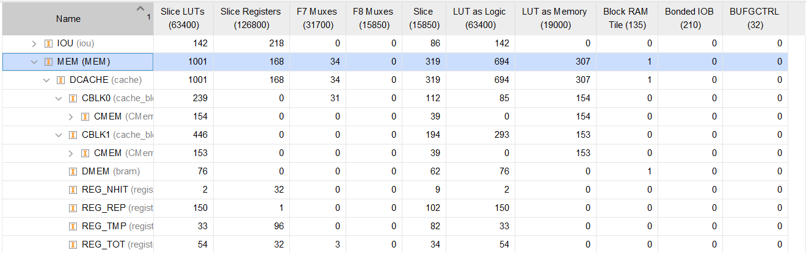

# LabH6 report

**PB21000039 陈骆鑫**


## 实验目的与内容

- 更改流水线CPU的数据存储结构：使用不同的配置的分布式存储器作为Cache，并将数据存储器改为块式存储器。
- 为CPU添加I/O单元，提供LED、CNT、SEG等I/O端口。
- 编写汇编程序，使其接受数组大小和数组首元素输入，动态生成数组并排序；验证排序是否成功，并输出所用时钟周期数。


## 汇编设计

我们排序部分沿用之前的程序，但需要为这个程序加上输入、输出、生成伪随机数、判断是否有序几个部分。

1. 输入输出采用流程图中的轮询机制即可。

2. 生成伪随机数要求使用LFSR算法。但PPT中描述的LFSR算法相对更适合硬件，相对难以用软件描述；因此这里采用对软件特化的Xor-Shift LFSR，C语言（伪）代码如下：

   ``` C
   unsigned xorshift32(unsigned x) {
       x |= (x == 0);   // if x == 0, set x = 1 instead
       x ^= (x & 0x0007ffff) << 13;
       x ^= x >> 17;
       x ^= (x & 0x07ffffff) << 5;
       return x;
   }
   ```

   利用此方法循环一遍，即可生成整个随机数组：

   ``` C
   unsigned ls = a[1];
   unsigned cnt = 1;
   unsigned *now = &a[2];
   
   while (cnt < n) {
       ls = xorshift(ls);
       *now = ls;
       cnt += 1;
       now += 1; // (+=4)
   }
   ```

3. 检查是否有序与上面类似。

   ``` C
   bool ans = true;
   
   unsigned ls = a[1];
   unsigned cnt = 1;
   unsigned *now = &a[2];
   
   while (cnt < n) {
       if (*now < ls) {
           ans = false;
           break;
       }
       ls = *now;
       cnt += 1;
       now += 1; // (+=4)
   }
   ```

   

## 逻辑设计

- 我们实现两种配置：直接映射以及两路组相连，块大小4字。直接分析两路组相连。
- 分析地址如下：
  - 4字即16字节，偏移有4位，即[4:0]（由于按字节寻址，实际用到的是其中的高两位）；
  - 总数据1K，可计算得块数为32，则索引为5位，即[8:4]；
  - 其余23位[31:9]均为Tag。
- 下面考虑Cache数据宽度：
  - 数据有16*8=256位；
  - Tag为23位；
  - 我们需要valid与dirty bit。注意要使用LRU算法替换；对于两路组相连，我们仅需1bit即可实现LRU；上次访问最终一定有一路命中，一路未命中；因此，只需每次访问记录是否命中，最终只需替换未命中的路。因此，我们加上一位access bit。
  - 因此数据宽度总共为3+23+256=282 bit。
- 根据上面的分析，设计单路Cache。
  - 首先，该Cache要能够在命中时响应读写请求；
  - 其次，在未命中时，要将access bit设置为0；
  - 最后，要能够响应整块换入换出的请求（对此，让其对整块256bit支持异步读同步写即可）。
  - 具体实现时，可以在内部例化一个分布式存储器，并根据外部请求动态调节存储器输入输出。
- 而对于Cache整体，我们例化两个Cache Way，使用一个状态机，根据当前状态动态控制向单个Way或向数据存储器的读写请求。
  - 状态转移大致如下：
    - 在S0状态若未命中，确定替换的路，若dirty bit为1则换出；之后将要访问的快换入，并返回S0；
    - 否则，处理读写请求，并回到S0。
  - 要求能够得到命中率。注意到在我们的设计每次访存最后总会命中，因此我们记录总命中次数即为总访存数。而离开S0就意味着一次未命中，因此总访存次数减去离开S0的次数即为命中次数。
- 对直接相连Cache，状态机思路不变，区别只有无需处理LRU，每次替换同一路。
- 对IOU，直接采用PPT中的描述即可。但PPT中有一些端口我们用不到，因此精简如下：
  - 
  - 我们想在CPU暂停时也能输入数据，因此主体采用全局时钟；但和CPU通信时采用CPU时钟，因此要注意不同时钟信号通信时的协调（有不同解决方案）。

## 仿真结果与分析

我们直接在仿真中模拟运行整个汇编程序以及输入，观察最后输出是否正确。



可以看到，LED最终被设置为1，说明已经验证完毕了整个数组的有序。


## 电路设计与分析

- MEM段电路图如下：
  
  可以看到其根据输入地址的不同，选择与Cache或IOU通信。
- 
  单个Cache Way的电路图如图，根据输入信号选择存储器的输入。
- 整个CPU的时间情况如下：
  
- IOU和MEM段资源占用如下：
  

## 测试结果与分析

对已实现的两种Cache配置的运行时间和命中率比较。

对相同的数组大小（十进制1000）和随机数种子，两种配置的表现如下：

- 两路组相连：命中率80e4/84c7；总时钟周期数32787；
- 直接映射：命中率786e/84c7；总时钟周期数4061c。

由于使用的堆排序算法本身就较为Cache不友好，并且频繁访问的为同一块数组，较少出现Index冲突的情况，命中率之间差别没有特别大，但也体现出了明显的差距。另外，由于直接相连块大小为8字，未命中时的代价明显更大，因此总时钟周期有显著差距。


## 总结

这次总体任务其实也不算繁重，但是可以参考的资料较少，需要自己思考设计的内容显著增多了。